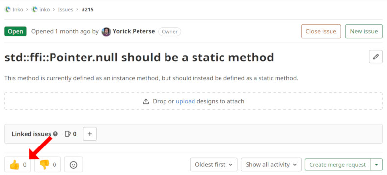
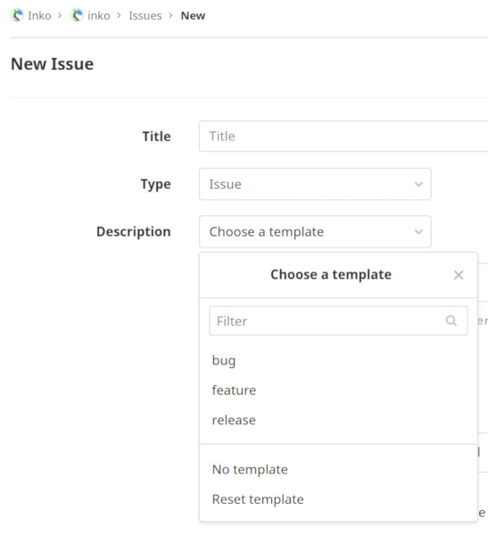

# Contributing to Inko

Thank you for contributing to Inko!

Before you continue reading this document, please familiarise yourself with our
[Code of Conduct](https://inko-lang.org/code-of-conduct/). All contributors are
expected to adhere to this code of conduct.

## Creating issues

### Reporting bugs

Bugs should be reported at the appropriate issue tracker. For example, bugs for
Inko itself should be reported in the project
[inko-lang/inko](https://gitlab.com/inko-lang/inko/-/issues), while bugs
specific to Inko's version manager should be reported in the project
[inko-lang/ivm](https://gitlab.com/inko-lang/ivm/-/issues). Here are a few of
our projects:

| Project            | Description               | Issue tracker
|:-------------------|:--------------------------|:----------------------------
| inko-lang/inko     | The main project for Inko | <https://gitlab.com/inko-lang/inko/-/issues>
| inko-lang/ivm      | Inko's version manager    | <https://gitlab.com/inko-lang/ivm/-/issues>
| inko-lang/inko.vim | Vim integration for Inko  | <https://gitlab.com/inko-lang/inko.vim/-/issues>
| inko-lang/website  | The Inko website          | <https://gitlab.com/inko-lang/website/-/issues>

For an up to date list, take a look at the [inko-lang GitLab
group](https://gitlab.com/inko-lang).

Before reporting a bug, please make sure an issue doesn't already exist for the
bug. To find all reported bugs, filter the list of issues using the `type::Bug`
label. Duplicate issues may be closed without warning. If you found an existing
issue, please don't reply with comments such as "Me too!" and "+1". Instead,
click on the thumbs up Emoji displayed when viewing the issue:



If no issue exists for the bug, please create a new issue. When reporting an
issue, please use the "bug" issue template. You can find this template in the
"Description" dropdown:



When selected, the issue description will be filled in with the template. Please
fill in all the necessary fields and sections. The more information you provide,
the easier it will be for maintainers to help you out.

### Feature requests

Before creating an issue to request a new feature, make sure no issue already
exists. Features use the label `type::Feature`. Similar to existing bug reports,
please use the thumbs up Emoji if you'd like to see the feature implemented;
instead of replying with comments such as "+1".

If no issue exists, you can create one using the "feature" issue template. When
requesting a new feature, please fill in all the sections of the issue template.
Also please include examples of how your feature would be used, details about
how other languages implement the feature (if applicable), and so on.

## Submitting changes

To submit changes to Inko, you'll need a local Git clone of the repository. If
you want to contribute to inko-lang/inko, you need to [build Inko from
source](getting-started/installation.md#building-from-source). Make sure you are
producing a development build by setting `DEV=1`.

### Rust code

Rust code is formatted using [rustfmt](https://github.com/rust-lang/rustfmt),
and [clippy](https://github.com/rust-lang/rust-clippy) is used for additional
linting. You can install both using [rustup](https://rustup.rs/) as follows:


```bash
rustup component add rustfmt clippy
```

For rustfmt we recommend setting up your editor so it automatically formats your
code. If this isn't possible, you can run it manually like so:

```bash
rustfmt --emit files src/path/to/file.rs
```

clippy can be run manually by running `cargo clippy`.

For unit tests we use Rust's built-in unit testing facilities. Tests are
included in the module of the code that is tested, instead of a separate module.
For an example, check out the [source code of Inko's bytecode
parser](https://gitlab.com/inko-lang/inko/-/blob/master/vm/src/bytecode_parser.rs).

Tests can be run by running `cargo test`. When contributing to the
inko-lang/inko project, run `make vm/test` instead to run all Rust unit tests.

### Inko code

For contributing changes to Inko source code, please follow [the Inko style
guide](style-guide.md). We don't have any tools yet to enforce the style guide,
so this is done manually during code review.

Standard library tests are located in `runtime/tests/test/std`. Test files are
named after the module they are testing, prefixed with `test_`. The directory
structure mimics that of the standard library, so tests for `std::foo::bar` are
located in `runtime/tests/test/std/foo/test_bar.inko`. The basic structure of a
test looks like this:

```inko
import std::test
import std::test::assert

test.group('Fully qualified name of the method to test') do (g) {
  g.test('A description of the test') {

  }
}
```

Generally, each test group (created using `test.group`) focuses on a single
method. In some cases a test group may cover more than a single method, if this
makes the testing process easier. For example, for the self-hosting compiler we
test larger chunks of code at a time, as this is easier compared to testing
every method in isolation.

Test names should be a clear and natural to read description of what the test
does, not what it expects. So "Adding two numbers" and not "it returns an
integer". Here's a simple example from the tests for the `std::ansi` module:

```inko
test.group('std::ansi.red') do (g) {
  g.test('Applying the color red to a String') {
    assert.equal(ansi.red('hello'), "\e[31mhello\e[0m")
  }
}
```

The module `runtime/tests/test/fixtures` provides some methods and constants to
use as fixtures. The module `runtime/tests/test/features` provides some methods
for feature detection. These methods are used when a test can only be run when
certain features are available.

To run Inko unit tests, run `make runtime/test`. This will compile and run all
unit tests. Running individual tests is not yet supported.

### Shell scripts

Some parts of our continuous integration setup depend on some shell scripts.
These scripts are checked using [shellcheck](https://www.shellcheck.net/). Lines
are wrapped at 80 characters per line.

### Documentation

Documentation is written in Markdown. There are two forms of documentation:
source code documentation, and the Inko manual.

For the manual we use [Vale](https://docs.errata.ai/vale/about) to enforce a
consistent style. We recommend setting up your editor so it automatically checks
Markdown using Vale. If this isn't possible, you can run Vale manually like so:

```bash
vale docs
```

For English, we use British English instead of American English.

### Writing commit messages

Writing a good commit message is important. Code and tests help explain what is
implemented and how it works. Commit messages help explain the thought process
that went into these changes, who is involved in the work, what work may be
related, and more. This information is invaluable to maintainers, for example
when debugging a bug introduced some time in the past.

Commit messages follow these rules:

1. The first line is the subject, and must not be longer than 50 characters.
1. The second line is empty.
3. The third and following lines make up the commit body. These lines must not
   be longer than 72 characters.

The second and all following lines can be left out if the subject is explanatory
enough.

The first line of a commit message is used when updating a project's changelog.

Here is an example of a good commit message:

```
Lint commits using gitlint

This adds a CI job called `lint:gitlint` that lints commits using
gitlint (https://github.com/jorisroovers/gitlint). In addition, we
include three custom linters to help enforce good commit message
practises. For example, commit bodies may not be longer than 72
characters _unless_ they exceed this limit due to a URL.
```

Another example can be seen in commit
[b64323](https://gitlab.com/inko-lang/inko/-/commit/b64323fe288e2c21aeff268ca27fa47b0ed8732d).

When writing commit messages, please refrain from including tags like "feat:",
"bug:", and others recommended by projects such as [Conventional
Commits](https://www.conventionalcommits.org/). Such information is not helpful
when looking at commits, and is better suited for issues and merge requests.
Keeping the above rules in mind, it also reduces the amount of space available
per line; the subject in particular.

 These rules are enforced using
 [gitlint](https://github.com/jorisroovers/gitlint), which runs as part of our
 continuous integration setup. If needed, you can run gitlint manually like so:

```bash
gitlint
```

To run gitlint for the last 10 commits:

```bash
gitlint --commits 'HEAD~10..HEAD'
```

For more details about writing commit messages, take a look at
[this article](https://chris.beams.io/posts/git-commit/).

### Creating merge requests

When your changes are ready, it's time to create a merge request. A merge
request allows maintainers to review your changes, verify the results of our
continuous integration setup, and accept the changes when approved.

GitLab doesn't support automatic testing of every commit in a merge request,
making it impossible to guarantee all commits work in isolation. This is
important as we may need to revert or cherry-pick certain commits, which
requires that they work in isolation. The GitLab UI also doesn't make it easy to
review different merge request commits in isolation. For this reason, we ask
that merge requests contain only a single commit.

When creating a merge request, make sure to use the right template: "bug" for
bug fixes, and "feature" for the addition of new features. For other types of
changes you don't need to use a template.

### Having your merge request reviewed

If your merge request is reviewed, please submit a merge request comment and
mention `@inko-lang` in the comment. For example:

```markdown
@inko-lang These changes are ready for review, could you take a look? Thanks!
```

The maintainers will then take a look at your changes, make sure the merge
request has the appropriate labels, and provide feedback on your changes.

## Working on the standard library

The standard library doesn't have access to the prelude. As such, the types and
methods exposed by the prelude must be imported explicitly.
