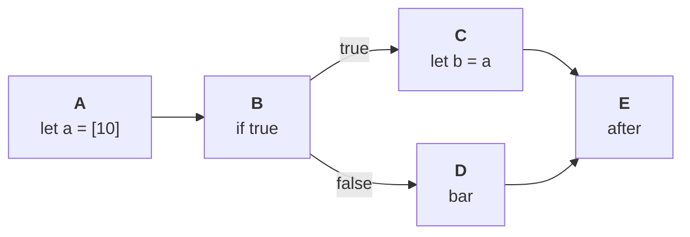

# The compiler

Inko's compiler compiles Inko source files into machine code using LLVM. The
compiler is written in Rust. Originally we had plans for a self-hosting
compiler, but have decided against taking this path (for the time being) to
simplify the process of developing and maintaining Inko.

The compilation process consists of the following steps:

1. Source code is recursively parsed into an AST, following any imported
   modules.
1. The AST is lowered into Inko's high-level intermediate representation, known
   as "HIR".
1. Type-checking is performed using HIR.
1. HIR is lowered into Inko's mid-level intermediate representation, creatively
   known as "MIR". MIR is a graph based linear IR, instead of the tree based
   HIR/AST.
1. MIR is used for enforcing single ownership and move semantics, optimisations,
   and other analysis that requires a more detailed IR (compared to HIR).
1. MIR is lowered into LLVM, which is then optimised further and compiled to
   machine code.
1. The resulting object files are linked together using the system linker.

## Parsing and the AST

Parsing is a topic extensively covered in computer science, so we won't go over
it in much detail. Inko uses a handwritten LL(1) recursive descend parser, and a
separate lexer/tokeniser. Each type of thing to parse (e.g. a class or an array
literal) typically has a corresponding function in the parser. AST nodes are
just plain structures.

Each AST node stores a source location, which is a line and column range. Source
file paths are not stored per AST node, instead we implicitly assume that all
AST nodes originating from a module share the same file; removing the need for
duplicating the file path for every AST node.

## HIR

HIR is essentially just the AST with some minor changes, and the ability to
store type information in nodes. Type information is typically stored in an
optional field called `resolved_type` (defaulting to `None`), though some nodes
may use different fields.

HIR exists because we want to keep the AST as close as possible to the source
code, making it possible to use the AST for e.g. a code formatter, but this
leads to it being a bit annoying to work with when type checking.

## Type checking

The type checker is essentially a recursive descend checker. It traverses the
HIR nodes and type-checks them in a depth-first order. Nodes are annotated with
their typing information whenever necessary.

Typing information is stored in the "type database". This is a structure that
looks a bit like a relational database, and is addressed using indexes to arrays
instead of pointers/references. It's these IDs that are stored in the AST nodes.
These IDs are globally unique, including for local variables. This makes it
easier for MIR to inline code, as MIR doesn't care about the variable names and
instead uses the variable IDs.

Type checking is done by performing multiple passes over the HIR, though not all
passes transform the entire HIR. Passes are typically just structures with a
`run_all` method that operates on a list of modules to check. For example,
there's a type checking pass that just defines types without descending into
their methods, while another pass ensures type parameter requirements are valid.
The result is a setup somewhat inspired by [The Nanopass
Framework](https://nanopass.org/), though not as extreme.

In general the compiler follows the principal that it's better to have too many
passes than too little, as merging passes is easier compared to splitting them
up.

## MIR

MIR is used for enforcing single ownership, move semantics, and more. It's a
graph based IR instead of a tree based IR. The graph consists of structures
known as basic blocks. Each block has zero or more instructions, stored in an
array. A block may flow into other blocks known as successors. The blocks that
flow into other blocks are known as the predecessor, as in `A -> B` means `A` is
the predecessor of `B`, while `B` is the successor of `A`. A block always ends
in an explicit jump to the next block, allowing the compiler to process blocks
in any order, making code generation easier.

### Pattern matching

Match expressions are compiled as part of lowering to MIR, including checking
for exhaustive patterns. Compilation follows a two-step process: first a match
expression is compiled into a decision tree, then we lower the decision tree
into MIR.

### Ownership

Ownership is enforced as follows: each expression stores its result in a virtual
register, and MIR operates on these registers instead of variables. For each
basic block we maintain a map of registers and their states, and blocks may
inherit the state from parent blocks. When looking up the state of a register,
we first check if the state is already known in the current block. If not, we
look it up in its predecessors and store the resulting state in the current
block. It's possible that two branches flow into a block, with each branch
having a different state for a register. Consider this code for example:

```inko
let a = [10]

if true {
  let b = a
} else {
  bar
}

after
```

We can represent this code using the following graph:



Now say we want to look up the state of the register storing `a`. If we follow
the path `A -> B -> C -> E`, its state is "moved" because of the expression
`let b = a`. But if we follow the path `A -> B -> D -> E` the register is still
available. The compiler handles this as follows: if we look up the state of a
register and encounter multiple predecessor blocks, the state is a sum of the
parent states. The state is calculated as follows:

- If the state is "available" in all parents, the state is "available".
- If the state is "moved" in all parents, the state is "moved".
- If the state is "available" in one or more parents, but a different state in
  one or more other parents, the state is "maybe moved".

It's an error to use a register in state other than "available", and the
compiler produces a corresponding error when encountering such code. These
states are also used to determine how to drop values.

The compiler also has a fourth state: "partially moved". This is used when a
moving method moves a field, in which case `self` is set to this state.

When traversing blocks to determine the register state, blocks already visited
are skipped. If due to some sort of compiler bug we can't determine a state, the
compiler terminates with a panic. This only happens in the event of a compiler
bug.

When values are moved, the old virtual registers are marked as "moved". When
exiting scopes, code is inserted to drop any registers not yet moved.

While the setup as described isn't that complex, implementing it correctly
proved quite a challenge. For example, during the development we ran into bugs
where explicit `return` expressions would drop registers not yet written to,
because the compiler would allocate the register, process a sub expression
containing a `return`, and not write a value until after processing that
expression. To handle such cases, the compiler in various places allocates
registers without storing them in the surrounding scope, then processes any sub
expressions, and _then_ adds the register to the surrounding scope.

### Dropping values

When MIR is first generated, each drop results in a "drop" node. After
performing the necessary analysis on MIR, these nodes are expanded into their
final nodes. For example, a drop node acting on an owned value is transformed
into three separate nodes:

1. A `check_refs` node that ensures no references exist to the value to drop.
1. A node that runs the dropper of the value.

The "dropper" is a generated method that recursively drops any fields, then runs
the value's destructor (if any). Once the dropper finishes it releases the
memory of the value.

### Optimisations

MIR is also used to perform optimisations. For example, when sending a message
to a process synchronously, the call is optimised into an instruction that
doesn't allocate a future. MIR will also be used for future optimisations, such
as inlining, devirtualisation, and dead code removal.

### Generics

Generic types and methods are specialized at the MIR level. Rather than
specialize generics for every type (meaning `Array[Foo]` and `Array[Bar]` result
in different specializations of `Array`), the compiler groups types into
"shapes" and specializes over these shapes. This approach results in a better
balance between compile times and runtime performance, instead of favoring
runtime performance over compile times (often resulting in long compile times).

The following shapes are used:

| Shape   | Dispatch | Purpose
|:--------|:---------|:-----------------------------------------------------
| Owned   | Dynamic  | The default shape and used for owned values that aren't given a more specific shape.
| Mut     | Dynamic  | Used for mutable references.
| Ref     | Dynamic  | Used for immutable references.
| Int     | Static   | Used for `Int`, removing the need for boxed integers.
| Float   | Static   | Used for `Float`, removing the need for boxed floats.
| Boolean | Static   | Used for the `Bool` type, which is internally represented as an unboxed `Int`.
| Nil     | Static   | Used for the `Nil` type, which is internally represented as an unboxed `Int` similar to `Bool`.
| String  | Static   | Used for the `String` type.
| Atomic  | Dynamic  | Used for other types that use atomic reference counting, such as `Channel` and processes.

This approach means that the following two methods compile to the same code,
provided the `foo` method is given an owned value:

```inko
fn foo[T: ToString](value: T) {}

fn bar(value: ToString) {}
```

If `foo` is instead given e.g. an `Int`, a version of `foo` is compiled that
specifically handles `Int`, resulting in different code.

Specialization is done in two stages: the initially generated MIR is generic.
For example, drops are handled using a generic "drop" instruction that
essentially acts as a placeholder to be replaced with a more specific
instruction.

After generating the initial MIR and verifying it, the compiler runs the pass
`mir::specialize::Speciailze`. This pass processes one method at a time,
starting with `Main.main`. The pass specializes types it encounters in
registers, and analyzes method calls to determine what other methods need to be
processed. This is done for both static and dynamic dispatch, and only takes
into account methods that are called somewhere in a program.

For dynamic dispatch, the compiler looks up the types that implement the
receiving trait, then schedules the called method for all those types. This may
result in the compiler processing more methods than strictly necessary, though
this likely won't be a problem in practise.

Once a method is specialized, two sub passes are run over the code:
`mir::specialize::ExpandReference` and `mir::specialize::ExpandDrop`. These
passes look for "reference" and "drop" instructions, and replace them with their
specialized counterparts. For example, for `Int` a "drop" translates into a
no-op, while for owned values it results in an instruction that calls the
dropper method.

The work finishes once there are no more methods to process. Once the pass
finishes, the generic code used to create the specialized types and methods is
removed.

If you'd like to know more, take a look at `compiler/src/mir/specialize.rs`. The
implementation is reasonably well documented, and may prove useful to other
compiler authors looking to provide a similar implementation.

## Code generation

Code generation is performed by lowering MIR into LLVM IR. This is done in a
single pass over all the MIR. This IR is then optimised using LLVM, and
converted into object files. These object files are then linked together.

Generating object files is done in parallel and incrementally. By default the
compiler uses as many threads as there are cores. A custom number of threads is
specified using `inko build --threads=N` where `N` is a value greater than zero.

Incremental compilation is used to only regenerate object files for which this
is necessary, greatly reducing the time spent in LLVM. Caches used by
incremental compilation are tied to the version of Inko used to compile them.
This means that when upgrading to a newer version of Inko, the cache is
refreshed automatically. Incremental compilation can be disabled using
`inko build --disable-incremental`.

### Methods

As part of code generation, methods are stored in a class such that we can
efficiently perform dynamic dispatch. Each class has a table for its method,
with the size being a power of two. Each method is given a globally unique hash
code based on its name. This means different methods with the same name share
the same hash code, but this is OK because a type can only define a method with
a given name once.

For each method we use the hash to calculate the ideal slot in the method table
to place the method in. If a slot is already occupied we assign the method to
the next available slot.

At runtime, dynamic dispatch is performed by taking the hash and hashing it into
a method slot. Since method table sizes are a power of two, this is done using a
bitwise AND instead of using the more expensive modulo operator. In other words,
to get the slot we use the following:

```
slot = hash & (size - 1)
```

To handle conflicts we use linear probing, resulting in an efficient
implementation of dynamic dispatch. For more information, refer to the article
["Shenanigans With Hash Tables"](https://thume.ca/2019/07/29/shenanigans-with-hash-tables/).
